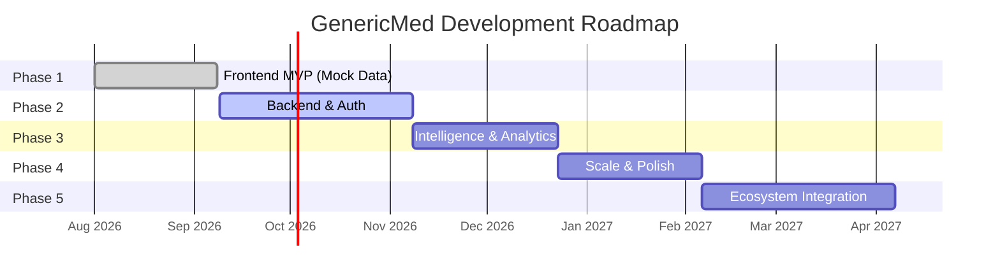
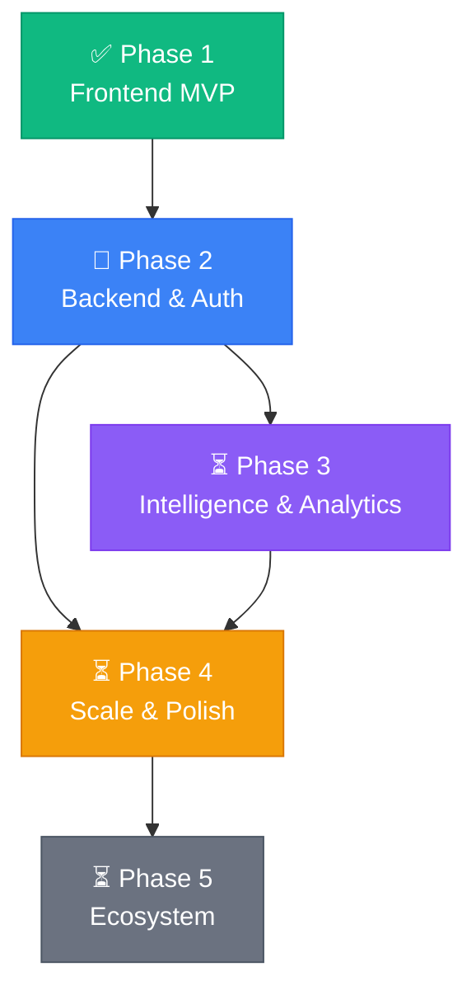

# 🚀 Project Phases

> **Purpose:** Detailed breakdown of the GenericMed development roadmap into actionable phases.
> Each phase includes goals, deliverables, tasks, dependencies, success criteria, and estimated effort.
> AI assistants should reference this file to understand project priorities and sequencing.

---

## Phase Overview

| Phase | Name                       | Status        | Priority | Est. Duration |
| ----- | -------------------------- | ------------- | -------- | ------------- |
| 1     | Frontend MVP (Mock Data)   | ✅ Complete    | —        | 5 weeks       |
| 2     | Backend & Auth             | 🔄 In Progress | Critical | 8–10 weeks    |
| 3     | Intelligence & Analytics   | ⏳ Planned     | High     | 6–8 weeks     |
| 4     | Scale & Polish             | ⏳ Planned     | Medium   | 6–8 weeks     |
| 5     | Ecosystem Integration      | ⏳ Planned     | Low      | 8–10 weeks    |

---

## ✅ Phase 1 — Frontend MVP (Mock Data)

> **Status:** Complete · **Completed:** 2026-09-08

### Goal
Build a fully functional, demo-ready frontend portal with realistic mock data to validate the product concept and UI/UX.

### Deliverables
- [x] Complete SPA with 8 page views
- [x] Auth screen (cosmetic)
- [x] 6 functional modals
- [x] Centralized type system and mock data
- [x] localStorage persistence
- [x] AI-powered pharmacist consultation (Gemini)
- [x] Responsive layout with sidebar navigation

### What Was Built

| Area               | Components                                                    |
| ------------------ | ------------------------------------------------------------- |
| **Auth**           | `AuthScreen.tsx`                                              |
| **Layout**         | `Header.tsx`, `Sidebar.tsx`                                   |
| **Pages**          | Dashboard, Medicine Cabinet, Prescriptions, Orders & Tracking, Savings, Dependents, Notifications, Settings |
| **Modals**         | Medication Detail, Add Medication, Refill, Upload Rx, Pharmacist Consult, Profile |
| **Data**           | `types.ts` (14 interfaces), `mockData.ts` (30KB mock dataset) |
| **State**          | React `useState` in `App.tsx` + `localStorage` hydration      |

### Success Criteria
- [x] All 8 pages render with realistic data
- [x] Users can mark doses as taken/skipped
- [x] Medication supply and refill tracking works
- [x] Order timeline displays correctly
- [x] Generic savings calculations are accurate
- [x] Dependent management CRUD works
- [x] AI pharmacist chat responds via Gemini API
- [x] Data persists across page refreshes via localStorage

---

## 🔄 Phase 2 — Backend & Auth

> **Status:** In Progress · **Est. Duration:** 8–10 weeks · **Priority:** Critical

### Goal
Replace mock data with a real backend, implement secure authentication, and establish a production-ready API layer.

### Prerequisites
- Phase 1 complete ✅
- Database hosting selected (PostgreSQL on Supabase/Railway or Firestore)
- Deployment environment configured (Cloud Run or Vercel)

### Deliverables

#### 2.1 — Database Setup
- [x] Choose PostgreSQL on Supabase
- [~] Implement schema from `memory.md` (users, dependents, medications, and doses complete)
- [ ] Create seed script from existing `mockData.ts`
- [ ] Set up database migrations (Prisma or Drizzle ORM)

| Task                                 | Priority | Complexity | Est. Effort |
| ------------------------------------ | -------- | ---------- | ----------- |
| Select & configure database          | Critical | Low        | 1 day       |
| Define ORM schema (Prisma/Drizzle)   | Critical | Medium     | 3 days      |
| Write migration scripts              | Critical | Medium     | 2 days      |
| Create seed script from mockData.ts  | High     | Low        | 1 day       |
| Test schema with sample queries      | High     | Low        | 1 day       |

#### 2.2 — API Layer
- [~] Set up Express.js API routes (health, auth, and medication routes complete)
- [ ] Implement CRUD endpoints for all entities
- [ ] Add input validation (Zod)
- [ ] Add error handling middleware
- [ ] API documentation (Swagger/OpenAPI)

| Endpoint Group     | Routes | Priority | Est. Effort |
| ------------------ | ------ | -------- | ----------- |
| Auth               | 4      | Critical | 3 days      |
| Medications        | 5      | Critical | 3 days      |
| Doses              | 2      | Critical | 2 days      |
| Prescriptions      | 3      | High     | 2 days      |
| Orders             | 3      | High     | 3 days      |
| Dependents         | 4      | High     | 2 days      |
| Notifications      | 3      | Medium   | 2 days      |
| AI Consult         | 1      | Medium   | 1 day       |

#### 2.3 — Authentication
- [~] Implement JWT-based auth (access tokens complete; refresh tokens remain)
- [x] Password hashing (`bcryptjs`)
- [x] Protected route middleware
- [ ] Session management
- [ ] Connect `AuthScreen.tsx` to real auth endpoints
- [ ] Implement logout and token refresh

| Task                                 | Priority | Complexity | Est. Effort |
| ------------------------------------ | -------- | ---------- | ----------- |
| JWT token generation & validation    | Critical | Medium     | 2 days      |
| Password hashing                     | Critical | Low        | 0.5 days    |
| Auth middleware                      | Critical | Medium     | 1 day       |
| Login / Register API endpoints       | Critical | Medium     | 2 days      |
| Frontend auth integration            | Critical | Medium     | 2 days      |
| Token refresh flow                   | High     | Medium     | 1 day       |

#### 2.4 — Frontend Integration
- [ ] Create API client service (`src/services/api.ts`)
- [ ] Replace `useState` + mock imports with `useEffect` + API calls
- [ ] Add loading states to all pages
- [ ] Add error boundaries and error states
- [ ] Remove localStorage hydration (keep as offline fallback)
- [ ] Implement optimistic updates for dose tracking

| Task                                 | Priority | Complexity | Est. Effort |
| ------------------------------------ | -------- | ---------- | ----------- |
| Create API client with interceptors  | Critical | Medium     | 2 days      |
| Refactor App.tsx state to API hooks  | Critical | High       | 5 days      |
| Add loading/error states to pages    | High     | Medium     | 3 days      |
| Optimistic updates for doses         | Medium   | Medium     | 2 days      |

#### 2.5 — Real-Time Features
- [ ] WebSocket server for live notifications
- [ ] Push dose reminders at scheduled times
- [ ] Live order tracking status updates

### Success Criteria
- [ ] Users can register, log in, and log out
- [ ] All CRUD operations persist to database
- [ ] Page refresh loads data from API (not localStorage)
- [ ] Unauthorized access returns 401
- [ ] API responds within 200ms for standard queries
- [ ] Zero data loss on concurrent operations

### Key Decisions Required
> ⚠️ These decisions should be documented in `decisions.md` before starting Phase 2.

- [x] **ADR-008:** PostgreSQL on Supabase
- [x] **ADR-009:** Prisma ORM
- [x] **ADR-010:** REST with Express and Zod
- [x] **ADR-011:** Custom JWT authentication with RBAC
- [x] **ADR-012:** Vite dev proxy and unified Express deployment

---

## ⏳ Phase 3 — Intelligence & Analytics

> **Status:** Planned · **Est. Duration:** 6–8 weeks · **Priority:** High

### Goal
Add AI-powered intelligence features and data-driven analytics to differentiate GenericMed from basic pharmacy portals.

### Prerequisites
- Phase 2 complete (live API & database)
- Gemini API integration proven (Phase 1 ✅)

### Deliverables

#### 3.1 — Medication Intelligence
- [ ] Drug interaction checker (AI-powered, Gemini API)
- [ ] Interaction severity levels (minor, moderate, major, contraindicated)
- [ ] Alert users when adding medications with known interactions
- [ ] Provide alternative drug suggestions

#### 3.2 — Adherence Analytics
- [ ] Adherence dashboard with historical charts (daily/weekly/monthly)
- [ ] Per-dependent adherence breakdown
- [ ] Trend analysis (improving, declining, stable)
- [ ] Streak tracking (consecutive days of full adherence)
- [ ] Charting library integration (Recharts or Chart.js)

#### 3.3 — Smart Refill System
- [ ] Predictive refill dates based on actual consumption patterns
- [ ] Auto-refill scheduling with configurable lead time
- [ ] Bundle refills for cost-efficient multi-medication orders
- [ ] Low supply forecasting and alerts

#### 3.4 — Pharmacist Consultation Enhancements
- [ ] Consultation history persistence (database-backed)
- [ ] Conversation context awareness (medication list, allergies)
- [ ] Follow-up reminders from AI consultations
- [ ] Export consultation summary as PDF

#### 3.5 — Prescription OCR
- [ ] Camera/file upload for prescription images
- [ ] OCR extraction (Google Cloud Vision or Gemini multimodal)
- [ ] Auto-populate prescription fields from scanned data
- [ ] Manual review and correction flow

### Success Criteria
- [ ] Drug interaction checker catches known interactions with ≥95% accuracy
- [ ] Adherence charts render historical data for 90+ days
- [ ] Refill predictions are within ±3 days of actual need
- [ ] OCR extracts medication name and dosage with ≥85% accuracy

---

## ⏳ Phase 4 — Scale & Polish

> **Status:** Planned · **Est. Duration:** 6–8 weeks · **Priority:** Medium

### Goal
Improve accessibility, performance, internationalization, and code quality to production-grade standards.

### Prerequisites
- Phase 3 complete (analytics & AI features)

### Deliverables

#### 4.1 — Dark Mode
- [ ] Implement theme toggle (light/dark/system)
- [ ] Update all Tailwind classes for dark variant support
- [ ] Persist theme preference in user settings
- [ ] Ensure WCAG AA contrast in both themes

#### 4.2 — Internationalization (i18n)
- [ ] Set up `react-i18next` or equivalent
- [ ] Extract all hardcoded strings to translation files
- [ ] Support English (default) + Spanish + Hindi
- [ ] Date, time, and currency formatting per locale
- [ ] RTL layout support (future: Arabic)

#### 4.3 — Performance Optimization
- [ ] Code splitting with `React.lazy` and `Suspense`
- [ ] Route-based lazy loading for page components
- [ ] Image optimization (WebP, lazy loading)
- [ ] Bundle analysis and tree shaking audit
- [ ] Lighthouse score target: ≥90 on all metrics
- [ ] Refactor `App.tsx` (625 lines → context + custom hooks)
- [ ] Refactor `SettingsPage.tsx` (47KB → sub-components)

#### 4.4 — Progressive Web App (PWA)
- [ ] Service worker for offline support
- [ ] App manifest for installability
- [ ] Offline dose tracking with background sync
- [ ] Cache API responses for offline browsing

#### 4.5 — Push Notifications
- [ ] Browser Push API integration
- [ ] Notification permission request flow
- [ ] Server-side push for dose reminders and order updates
- [ ] Notification preferences sync with user settings

#### 4.6 — Testing
- [ ] Set up Vitest for unit testing
- [ ] React Testing Library for component tests
- [ ] Playwright for E2E tests
- [ ] CI/CD pipeline with test gates
- [ ] Minimum 80% coverage on business logic
- [ ] Regression tests for all bug fixes

#### 4.7 — Accessibility Audit
- [ ] Full WCAG 2.1 AA compliance audit
- [ ] Screen reader testing (NVDA, VoiceOver)
- [ ] Keyboard navigation for all flows
- [ ] Focus management in modals
- [ ] ARIA labels and roles audit

### Success Criteria
- [ ] Dark mode works across all pages without visual regressions
- [ ] App loads in <2s on 3G connection
- [ ] Lighthouse scores ≥90 (Performance, Accessibility, Best Practices, SEO)
- [ ] Test coverage ≥80% for business logic
- [ ] App is installable as PWA on mobile

---

## ⏳ Phase 5 — Ecosystem Integration

> **Status:** Planned · **Est. Duration:** 8–10 weeks · **Priority:** Low

### Goal
Connect GenericMed to external healthcare systems, insurance providers, and communication platforms for a complete patient management ecosystem.

### Prerequisites
- Phase 4 complete (production-grade quality)
- Legal review for HIPAA compliance
- Partnership agreements with pharmacy networks

### Deliverables

#### 5.1 — Pharmacy Network Integration
- [ ] Pharmacy locator with map view
- [ ] Prescription transfer between pharmacies
- [ ] Real-time drug pricing from partner pharmacies
- [ ] Preferred pharmacy setting per user

#### 5.2 — Insurance & HSA Integration
- [ ] Insurance card scanning and storage
- [ ] Copay estimation at checkout
- [ ] HSA/FSA eligible item flagging
- [ ] Claims submission and tracking
- [ ] Explanation of Benefits (EOB) viewer

#### 5.3 — Telehealth
- [ ] Video call with prescribing physicians
- [ ] In-app scheduling for telehealth appointments
- [ ] Prescription renewal via telehealth
- [ ] Visit summary notes linked to medications

#### 5.4 — Wearable & Health App Sync
- [ ] Apple HealthKit integration
- [ ] Google Fit / Health Connect integration
- [ ] Medication reminders on smartwatches
- [ ] Vitals tracking linked to medication efficacy

#### 5.5 — Caregiver Collaboration
- [ ] Multi-caregiver access per dependent
- [ ] Role-based permissions (view-only, manage, full access)
- [ ] Activity log for caregiver actions
- [ ] In-app messaging between caregivers
- [ ] Escalation workflows with configurable rules

### Success Criteria
- [ ] At least 1 pharmacy network integration live
- [ ] Insurance copay estimates are within ±$5 of actual
- [ ] Telehealth calls work with <500ms latency
- [ ] Wearable sync updates in near real-time (<30s delay)
- [ ] HIPAA compliance certification obtained

---

## 📊 Phase Dependency Map

> **Note:** Phase 4 (Scale & Polish) can partially overlap with Phase 3 — testing and dark mode can begin while AI features are being developed. Phase 5 requires Phase 4 to be complete due to HIPAA compliance requirements.

---

## 📝 How to Update This File

When starting or completing a phase:

1. Update the **status** in the Phase Overview table.
2. Check off completed deliverables within the phase.
3. Log the completion date.
4. Add any new tasks discovered during development.
5. Update `memory.md` roadmap section to stay in sync.
6. Create ADRs in `decisions.md` for any architectural decisions made.
7. Log changes in `changelog.md`.
